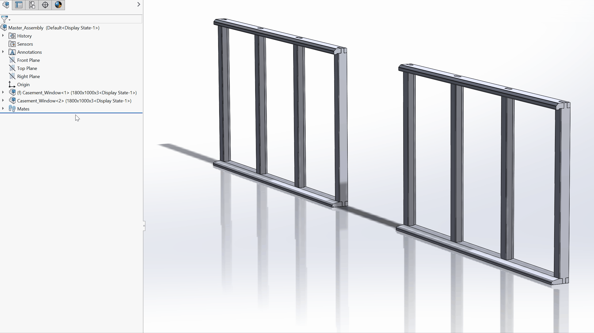

# Configurations example
An example of what can be done with configurations and design tables. A feature that is seriously lacking in Fusion 360.

This example of a casement window only has three part files.

### Sill
Two configurations, specifying length and number of mortises to cut (using linear pattern).

### Head jamb
Two configurations, specifying length and number of mortises to cut (using linear pattern).

### Vertical jamb
Three configurations. Left hand rebate, right hand rebate and center rebate.

In addition to the confiurations above, I can easily add different lengths and number of mortises by creating a new entry in the design table (embedded Microsoft Excel), thus creating a new configuration. Design tables are so much quicker that using the configuration manager as it's as simple as entering a new row of data in Excel.

Although the part-level linear copy has come on a long way and allows equations and centroids, unfortunatly, the assembly-level linear component copy has no such capability, so if a new verical jamb is required, it will have to be manually placed (this may have improved in new versions).
